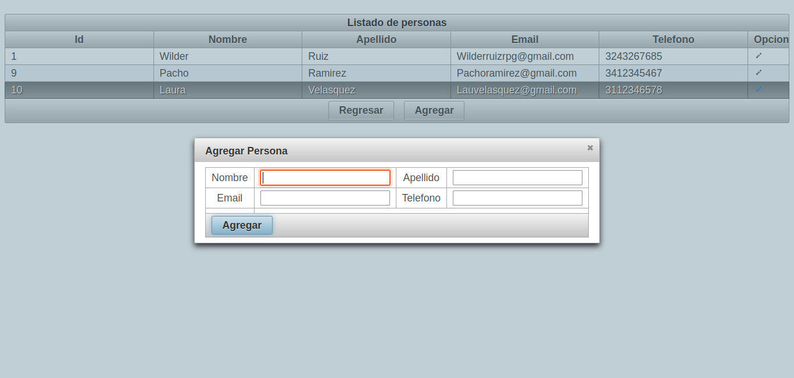

# PrimeFaces-JPA-Gestor

## Características Principales

- Interfaz de Usuario Moderna y Amigable con PrimeFaces
- Integración de Tecnologías Java EE como EJB y JPA para una Arquitectura Escalable
- Base de Datos MySQL para un Almacenamiento Robusto y Confiable
- Comunicación en Tiempo Real Habilitada a Través de AJAX
- Despliegue y Administración con GlassFish Server

Este proyecto ofrece una completa solución de gestión de recursos humanos desarrollada en Java, aprovechando tecnologías como JSF, PrimeFaces, EJB, MySQL, JPA y AJAX. La aplicación está diseñada para proporcionar una experiencia interactiva y eficiente para la administración de personal en entornos empresariales.

## Captura

## Requisitos de Instalación

- [Java Development Kit (JDK)](https://www.oracle.com/java/technologies/javase-downloads.html)
- [MySQL Database](https://dev.mysql.com/downloads/installer/)
- [GlassFish Server](https://javaee.github.io/glassfish/download)

## Configuración y Despliegue

1. Clona el repositorio en tu entorno local.
2. Importa el proyecto en tu IDE preferido que soporte Java y Maven.
3. Configura la conexión a la base de datos MySQL en `src/main/resources/META-INF/persistence.xml`.
4. Despliega la aplicación en GlassFish Server.

## Uso

- Accede a la aplicación desde tu navegador web: `http://localhost:8080/sga-jee-web`

## Contribuciones

Si deseas contribuir a este proyecto, por favor sigue estos pasos:

1. Haz un fork del repositorio.
2. Crea una rama con una descripción significativa: `git checkout -b nueva_caracteristica`.
3. Desarrolla y prueba tus cambios.
4. Asegúrate de que tu código siga las prácticas de estilo y está debidamente comentado.
5. Haz un pull request a la rama principal del repositorio original.

## Contacto

Para preguntas o comentarios, no dudes en contactarme a través de [wilderruizrpg@gmail.com](mailto:wilderruizrpg@gmail.com).

---

© 2023 Wilder Ruiz.

Licenciado bajo la  [Licencia MIT.](LISENCE)
